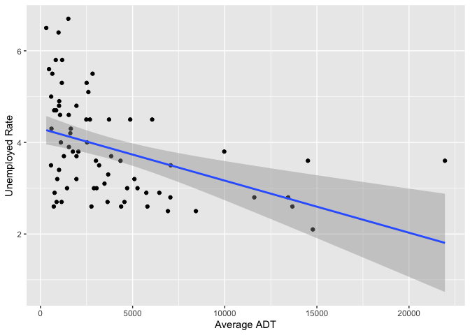

HW 2
================

**Load in and Prepare the Data**

``` r
library(dplyr)
```

    ## 
    ## Attaching package: 'dplyr'

    ## The following objects are masked from 'package:stats':
    ## 
    ##     filter, lag

    ## The following objects are masked from 'package:base':
    ## 
    ##     intersect, setdiff, setequal, union

``` r
library(ggplot2)
library(blscrapeR)
library(readr)
library(data.table)
```

    ## 
    ## Attaching package: 'data.table'

    ## The following objects are masked from 'package:dplyr':
    ## 
    ##     between, first, last

``` r
df <- get_bls_county()
WIunemployment = df %>% filter(fips_state == 55)

bridges = read_csv("https://www.fhwa.dot.gov/bridge/nbi/2018/delimited/WI18.txt")
```

    ## Parsed with column specification:
    ## cols(
    ##   .default = col_double(),
    ##   STRUCTURE_NUMBER_008 = col_character(),
    ##   ROUTE_NUMBER_005D = col_character(),
    ##   HIGHWAY_DISTRICT_002 = col_character(),
    ##   COUNTY_CODE_003 = col_character(),
    ##   FEATURES_DESC_006A = col_character(),
    ##   CRITICAL_FACILITY_006B = col_logical(),
    ##   FACILITY_CARRIED_007 = col_character(),
    ##   LOCATION_009 = col_character(),
    ##   LRS_INV_ROUTE_013A = col_character(),
    ##   LAT_016 = col_character(),
    ##   LONG_017 = col_character(),
    ##   MAINTENANCE_021 = col_character(),
    ##   OWNER_022 = col_character(),
    ##   FUNCTIONAL_CLASS_026 = col_character(),
    ##   DESIGN_LOAD_031 = col_character(),
    ##   RAILINGS_036A = col_character(),
    ##   TRANSITIONS_036B = col_character(),
    ##   APPR_RAIL_036C = col_character(),
    ##   APPR_RAIL_END_036D = col_character(),
    ##   NAVIGATION_038 = col_character()
    ##   # ... with 41 more columns
    ## )

    ## See spec(...) for full column specifications.

    ## Warning: 3 parsing failures.
    ##   row                     col               expected actual                                                          file
    ##  5739 OTHR_STATE_STRUC_NO_099 no trailing characters   B010 'https://www.fhwa.dot.gov/bridge/nbi/2018/delimited/WI18.txt'
    ## 11175 OPR_RATING_METH_063     a double                 F    'https://www.fhwa.dot.gov/bridge/nbi/2018/delimited/WI18.txt'
    ## 11175 INV_RATING_METH_065     a double                 F    'https://www.fhwa.dot.gov/bridge/nbi/2018/delimited/WI18.txt'

``` r
br = bridges %>% group_by(COUNTY_CODE_003) %>% summarize(meanADT = mean(ADT_029)) %>% left_join(WIunemployment,by = c("COUNTY_CODE_003" = "fips_county"))
```

**Build up the linear models**

``` r
model_unemployed = lm(WIunemployment$unemployed ~ br$meanADT)
model_unemployed_rate = lm(WIunemployment$unemployed_rate ~ br$meanADT)
summary(model_unemployed)
```

    ## 
    ## Call:
    ## lm(formula = WIunemployment$unemployed ~ br$meanADT)
    ## 
    ## Residuals:
    ##     Min      1Q  Median      3Q     Max 
    ## -3080.0  -321.3   100.0   370.5  6950.9 
    ## 
    ## Coefficients:
    ##               Estimate Std. Error t value Pr(>|t|)    
    ## (Intercept) -379.31266  182.64135  -2.077   0.0415 *  
    ## br$meanADT     0.45914    0.03276  14.017   <2e-16 ***
    ## ---
    ## Signif. codes:  0 '***' 0.001 '**' 0.01 '*' 0.05 '.' 0.1 ' ' 1
    ## 
    ## Residual standard error: 1132 on 70 degrees of freedom
    ## Multiple R-squared:  0.7373, Adjusted R-squared:  0.7335 
    ## F-statistic: 196.5 on 1 and 70 DF,  p-value: < 2.2e-16

``` r
summary(model_unemployed_rate)
```

    ## 
    ## Call:
    ## lm(formula = WIunemployment$unemployed_rate ~ br$meanADT)
    ## 
    ## Residuals:
    ##     Min      1Q  Median      3Q     Max 
    ## -1.6206 -0.7730 -0.1799  0.6520  2.5691 
    ## 
    ## Coefficients:
    ##               Estimate Std. Error t value Pr(>|t|)    
    ## (Intercept)  4.303e+00  1.614e-01   26.66  < 2e-16 ***
    ## br$meanADT  -1.137e-04  2.894e-05   -3.93 0.000197 ***
    ## ---
    ## Signif. codes:  0 '***' 0.001 '**' 0.01 '*' 0.05 '.' 0.1 ' ' 1
    ## 
    ## Residual standard error: 1 on 70 degrees of freedom
    ## Multiple R-squared:  0.1807, Adjusted R-squared:  0.169 
    ## F-statistic: 15.44 on 1 and 70 DF,  p-value: 0.0001974

**Draw linear model line**

``` r
model_unemployed %>% ggplot(aes(br$meanADT, WIunemployment$unemployed)) + geom_point() + geom_smooth(method = "lm") + labs(x = "Average ADT", y = "Unemployed Number")
```


``` r
model_unemployed_rate %>% ggplot(aes(br$meanADT, WIunemployment$unemployed_rate)) + geom_point() + geom_smooth(method = "lm") + labs(x = "Average ADT", y = "Unemployed Rate")
```


